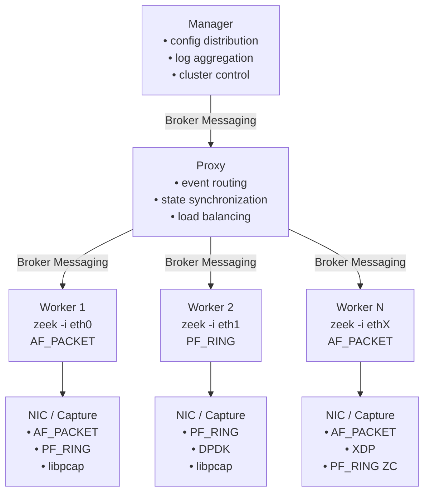

# Zeek Cluster Architecture

This document describes the modern Zeek cluster layout including Manager, Proxy, Workers, and NIC capture methods (AF_PACKET, PF_RING, DPDK, XDP).

## ASCII Diagram (Original)

```text
<your ASCII diagram here>
```

## Mermaid Diagram (Rendered on GitHub)


